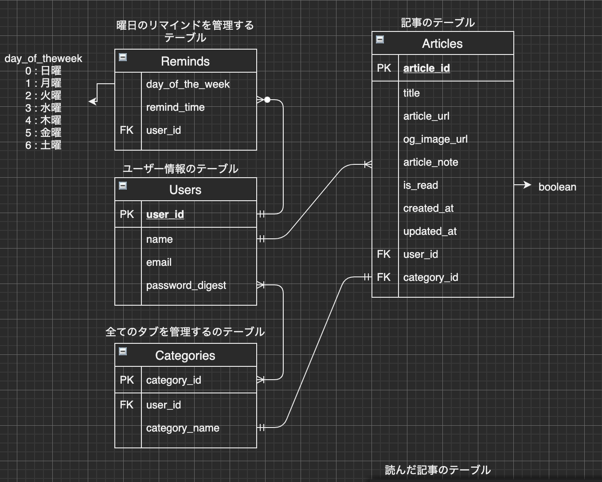
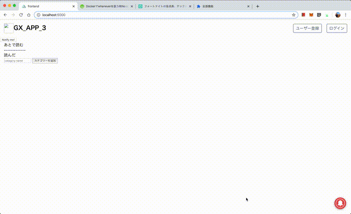

# gx_app_3

# 概要
情報を逃さずインプットの定着を図るアプリです。 
インターネットにある記事を保存できるあとで読む系のサービスに近いですが、記事の内容を覚えるためにメモを追加できたり、たまった記事を消化できるようにリマインド設定できたりします。 

# Developer's guide

## 開発関係情報

### ERD


### デモ動画


##  インストール

```
git clone git@github.com:Yosuke-Aramaki/gx_app_3.git
cd gx_app_3
git checkout development
```

### Rails APIのセットアップ
[rails_api/README.md](/rails_api)

### Nuxt フロントエンドのセットアップ
[frontend/README.md](/frontend)

### Chrome Extensionのセットアップ
[extension/README.md](/extension)


